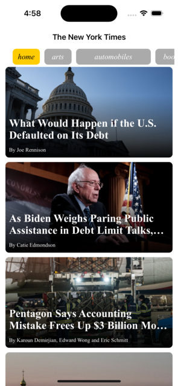
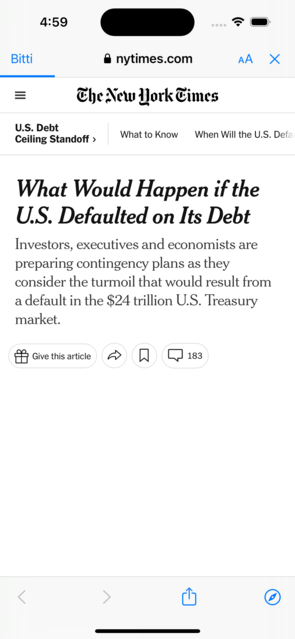

# News App

## Description

The News App is an iOS application developed using Swift and the **MVVM** (Model-View-ViewModel) design pattern. It leverages The New York Times Top Stories API to fetch and display news articles from various categories. The app provides a user-friendly interface for browsing and reading news articles. App is compatible to work in portrait and landscape mode.

## Features

- Browse news articles from different categories: Top Stories, Arts, Business, Sports, and more.
- There are two pages named as **Home** and **Details** to navigate
- Tap and browse news related with categories from the list above
- View detailed information about each news article, including the title, author, date, and abstract.
- Load news article images asynchronously using the **SDWebImage** library for a smooth user experience.
- Click to **Read More** button to open related articles on Details Page without leaving from app
- Seamlessly navigate between different sections of the app using a clean and intuitive user interface.

## Requirements

- iOS 13.0+
- Xcode 12.0+
- Swift 5.0+

## Dependencies

 - Alamofire 5.7.1
 - SDWebImage 5.15.8

## Installation

1. Clone the repository:
git clone [https://github.com/ssertgoz/SerdarSertgoz_HW2.git](https://github.com/ssertgoz/SerdarSertgoz_HW2.git)

2. Open the project in Xcode.

3. Open the `NewsApp.xcworkspace` file.

4. Build and run the app on a simulator or physical device.

## Usage

Upon launching the app, you will be presented with a list of top news articles from The New York Times. You can tap on an article to view its details, including the title, author, date, and abstract. Use the buttons list above to switch between different news categories.

## Screenshots

## Demo Video

## Contributing

Contributions are welcome! If you find any issues or have suggestions for improvement, please submit a pull request or open an issue.

## License

This project is licensed under the MIT License. See the [LICENSE](LICENSE) file for more information.

